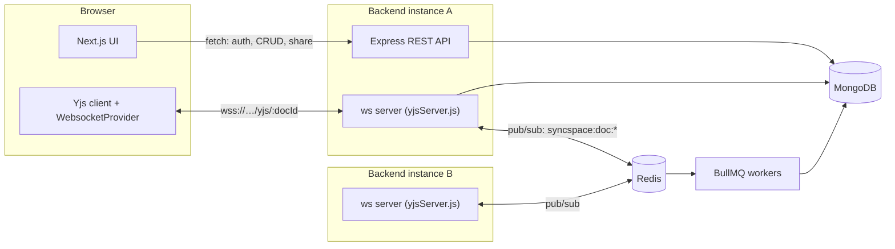
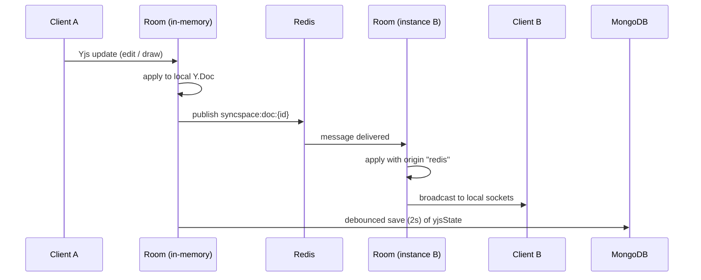
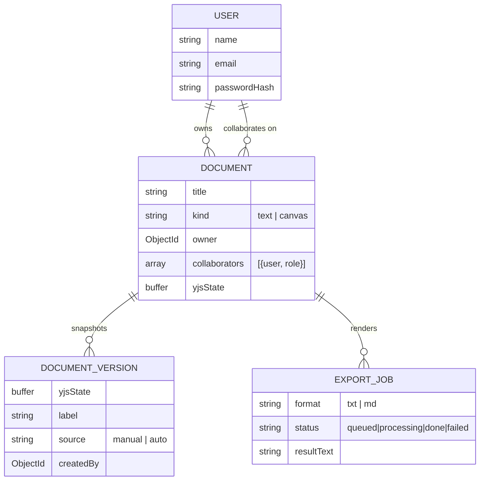

# SyncSpace

A real-time collaborative workspace — plain-text documents and Excalidraw whiteboards, both synced live across every connected client via a hand-rolled [Yjs](https://docs.yjs.dev/) CRDT sync core, horizontally scaled with a Redis pub/sub relay.

Two independently deployable services: a Next.js frontend and an Express + WebSocket backend, talking to each other only over the public REST/WebSocket surface — never a build-time dependency.

## Features

- **Real-time text documents** — every keystroke syncs to every connected collaborator with no save button, and resolves cleanly even when two people edit the same spot at the same time.
- **Real-time whiteboards** — an [Excalidraw](https://github.com/excalidraw/excalidraw) canvas with a custom Yjs sync bridge: live shape sync, live cursors, and "so-and-so is drawing" presence labels.
- **Offline-first** — edits made while disconnected queue locally and reconcile automatically on reconnect, no data loss.
- **Role-based sharing** — owner / editor / viewer, enforced server-side at both the REST layer and the raw WebSocket protocol layer, not just hidden in the UI.
- **Version history** — save a named snapshot at any point, restore it later; the restore replays live to every connected client.
- **Background export jobs** — render a text document to `.txt`/`.md` asynchronously via BullMQ.
- **Horizontal scaling** — multiple backend instances stay consistent through a Redis pub/sub relay, verified with real multi-process tests.

## Architecture



The frontend is never in the WebSocket path — it's plain Next.js hosting (Vercel or any Node host). The backend needs a long-running process (Render/Railway/Fly.io, not serverless) since it holds persistent WebSocket connections.

### Real-time core

One in-memory `Room` per open document per backend instance: a live `Y.Doc`, its connected sockets, and a Yjs `Awareness` instance for presence. The room is **content-agnostic** — it relays Yjs sync messages and enforces permissions on message *type*, never on which root shared-type the bytes touch, which is what let the whiteboard reuse this exact layer with zero changes.



Every document's `Y.Doc` exposes exactly one root shared type, named by document `kind`:

| Kind | Root type | Purpose |
|---|---|---|
| `text` | `Y.Text` named `"content"` | plain-text document body |
| `canvas` | `Y.Map` named `"shapes"`, keyed by element id | whiteboard elements |

### Whiteboard sync bridge

`@excalidraw/excalidraw` ships no multiplayer sync of its own — this is the piece built specifically for SyncSpace (`web/src/components/whiteboard/excalidraw-board.tsx`):

- **Local → shared map**: `onChange` fires on every scene mutation; skip if it's an echo of our own remote apply (version check); throttle 50ms, flush instantly on pointer-up; `Y.Map.set(id, element)` tagged with a local transaction origin.
- **Shared map → local scene**: `shapes.observe()` fires on any remote change; skip if the transaction origin is our own; merge via Excalidraw's own `reconcileElements()`; `updateScene()` with `captureUpdate: NEVER`.
- **Deletes are tombstoned**, never a real `Y.Map` key removal — an element gets `isDeleted: true`, mirroring Excalidraw's own convention, since `reconcileElements()` otherwise keeps any local element simply missing from the remote side.
- **Live cursors and in-progress actions** ride the same Yjs `Awareness` channel as presence, with two ephemeral fields that never touch persisted state: `cursor: {x, y}` (re-projected into each peer's own pan/zoom via `sceneCoordsToViewportCoords`) and `action: {type, elementIds}` (set on pointer-down, cleared on pointer-up).

### Data model



`yjsState` is the only field never sent over REST — it travels solely through the WebSocket sync protocol and the version-restore path.

### Permissions & security

Owner / editor / viewer, resolved once by `Document.getRole(userId)` and consulted identically by the REST layer and the WebSocket layer — one source of truth, not two checks that could drift.

- REST: viewer role blocked with `403` on any mutating request.
- WebSocket: the sync sub-message *type* is inspected directly — a read-only "what do you have" request is allowed for any role; anything that calls `Y.applyUpdate` is dropped server-side for viewers, regardless of what the client UI shows. Verified with a raw hand-crafted protocol message sent directly over the socket, bypassing the UI entirely.
- JWT is verified during the WebSocket upgrade itself, not after the socket opens.

### Background jobs

- **Export worker** — renders a text document to `.txt`/`.md` off the request path; canvas documents are rejected with a `400` before a job is even queued.
- **Snapshot scheduler** — a repeatable BullMQ job, every 5 minutes, auto-saves only rooms flagged dirty since their last snapshot.

## Tech stack

| Layer | Technology |
|---|---|
| Frontend | Next.js 16 (App Router, Turbopack), TypeScript, Tailwind v4, shadcn/ui |
| Real-time client | `yjs`, `y-websocket` |
| Whiteboard | `@excalidraw/excalidraw` |
| Backend | Node.js, Express, raw `ws` WebSocket server |
| Real-time protocol | `yjs`, `y-protocols` (sync, awareness) |
| Auth | `jsonwebtoken`, `bcrypt` |
| Database | MongoDB (`mongoose`) |
| Cache / messaging | Redis (`ioredis`) — pub/sub relay + BullMQ backend |
| Background jobs | `bullmq` |

## Getting started

### Prerequisites

- Node.js 20+
- Docker (for MongoDB + Redis via `docker-compose.yml`)

### 1. Start MongoDB and Redis

```bash
docker compose up -d
```

This starts `syncspace-mongo` (port `27017`) and `syncspace-redis` (port `6380`, deliberately non-default to avoid colliding with any other local Redis).

### 2. Backend

```bash
cd backend
npm install
cp .env.example .env
# fill in JWT_SECRET — generate one with: openssl rand -hex 32
npm run dev
```

Runs on `http://localhost:4000`.

### 3. Frontend

```bash
cd web
npm install
cp .env.example .env.local
npm run dev
```

Runs on `http://localhost:3000` (or the next free port).

### Environment variables

**`backend/.env`**

| Variable | Purpose |
|---|---|
| `MONGO_URI` | MongoDB connection string |
| `PORT` | Backend HTTP/WebSocket port (default `4000`) |
| `REDIS_URL` | Redis connection string, for the cross-instance pub/sub relay |
| `JWT_SECRET` | Signing secret for auth tokens |
| `CLIENT_ORIGIN` | Frontend origin, for CORS |

**`web/.env.local`**

| Variable | Purpose |
|---|---|
| `NEXT_PUBLIC_API_URL` | Backend base URL (REST + WebSocket) |

## Project structure

```
backend/
  src/
    config/         # db + BullMQ queue setup
    models/         # Document, DocumentVersion, ExportJob, User
    controllers/    # documentController, versionController, authController
    routes/         # documentRoutes, authRoutes
    middleware/     # requireAuth, asyncHandler
    realtime/
      yjsServer.js  # Room, sync/awareness protocol, restore
      redisRelay.js # cross-instance pub/sub
    jobs/
      exportWorker.js
      snapshotScheduler.js
    server.js

web/
  src/
    app/
      (auth)/login/, register/
      (app)/
        page.tsx           # dashboard
        documents/[id]/    # text editor
        boards/[id]/       # whiteboard
    components/
      ui/                  # shadcn primitives
      whiteboard/
        excalidraw-board.tsx
      document-chrome.tsx
      share-panel.tsx
      version-history-drawer.tsx
    context/
      auth-context.tsx
    realtime/
      use-yjs-document.ts
      use-ytext-binding.ts
    api/
      client.ts
      types.ts
```

## API reference

All routes are prefixed `/api`. Every `/documents` route requires a valid JWT.

| Method | Route | Purpose |
|---|---|---|
| `POST` | `/auth/register` | Create an account |
| `POST` | `/auth/login` | Sign in, get a JWT |
| `GET` | `/auth/me` | Current session check |
| `GET` | `/documents` | List documents visible to the caller, with resolved role |
| `POST` | `/documents` | Create a document (`kind: "text" \| "canvas"`) |
| `GET` | `/documents/:id` | Fetch a document |
| `PATCH` | `/documents/:id` | Rename a document |
| `DELETE` | `/documents/:id` | Delete a document (owner only) |
| `GET` | `/documents/:id/collaborators` | List collaborators |
| `POST` | `/documents/:id/collaborators` | Share by email + role (owner only) |
| `DELETE` | `/documents/:id/collaborators/:userId` | Revoke access |
| `GET` | `/documents/:id/versions` | List saved versions |
| `POST` | `/documents/:id/versions` | Save a named snapshot |
| `POST` | `/documents/:id/versions/:versionId/restore` | Restore a snapshot live |
| `POST` | `/documents/:id/exports` | Queue a text export job |
| `GET` | `/documents/:id/exports/:exportJobId` | Poll export job status |

Live document content itself never goes through these routes — it's carried entirely over `ws(s)://<backend>/yjs/:docId?token=<jwt>`.

## Deployment

See [`DEPLOYMENT.md`](./DEPLOYMENT.md) for the full guide (Vercel for the frontend, a long-running Node host for the backend, MongoDB Atlas, a managed Redis add-on).
